# Adaptive Barcode Reader

This git repository provides an adaptive barcode detection and decoding function for robust barcode detection and decoding. The project is a part of expert in team inovation project (E22).

## Method
The flowchart of the provided example program is presented in the figure below. The "adaptive barcode detection and decoding" block denotes the "adaptive_read()" function imported from "barcode_reader.py".

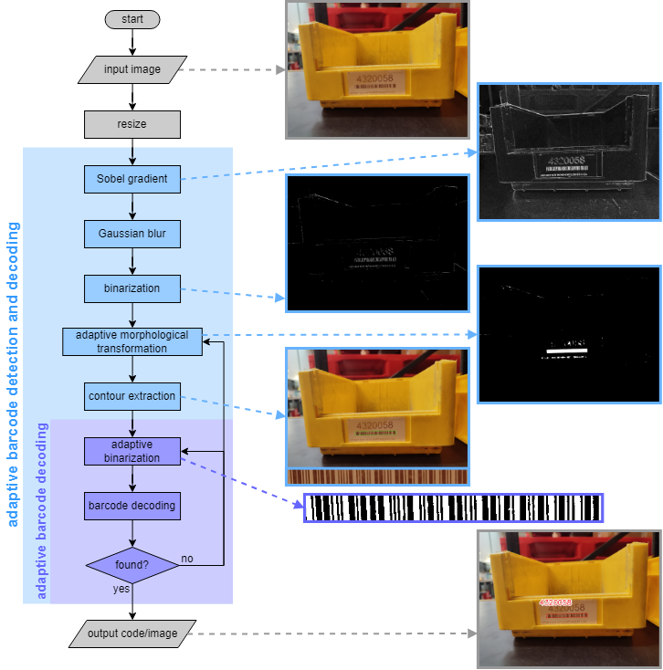


# Installation 

To install the required python modules (standard modules, such as numpy and opencv, not included), run ` pip install -r requirement.txt `.


# Runing The Example
## Running an example program
To run an example code, please run ` python example.py `. The example program will perform adaptive barcode detection and decoding on all images locating in the "imgs" folder.
## Running the markdown documentation
To view the readme, please run ``` grip -b readme.md ```.

# Adaptive Barcode Detection and Decoding
### python code:
```
from barcode_reader import *
img = <input image>
code, intermediate_imgs = adaptive_read(img, imgsize=(<width>,<height>), detectionparams=(<k>,<dk>,<kmax>), binarizationparams=(<th>,<dth>,<thmax>))
```
### adaptive_read()
**File:** barcode_reader.py

**Description:** perform adaptive barcode detection and decoding

**Input:**
1. img (opencv array): an image of an arbitrary size
2. imgsize (tuple (w,h)): the desired size (width,height)
3. detectionparams (tuple (k,dk,kmax)): the adaptive detection parameters
	- k (int): initial morphological transformation kirnel size
	- dk (int): morphological transformation kirnel step size
	- kmax (int): maximum morphological transformation kirnel step size
4. binarizationparams (tuble (th,dth,thmax)): adaptive binarization parameters
	- th (int): initial threshold
	- dth (int): threshold step
	- thmax (int): maximum threshold

**Output:**
1. code (string): barcode data
2. intermidiate_imgs (list of images): intermediate images

# Result
**test1.jpg**


**test2.jpg**
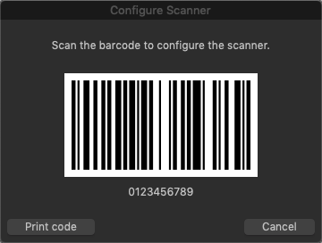
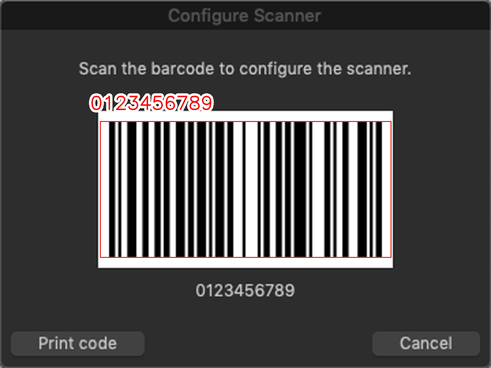
**test3.jpg**
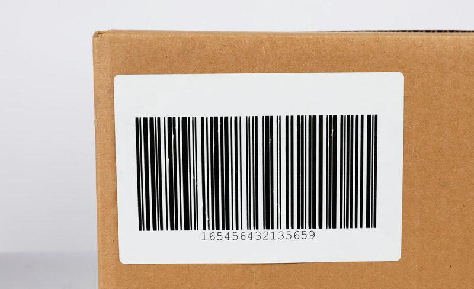
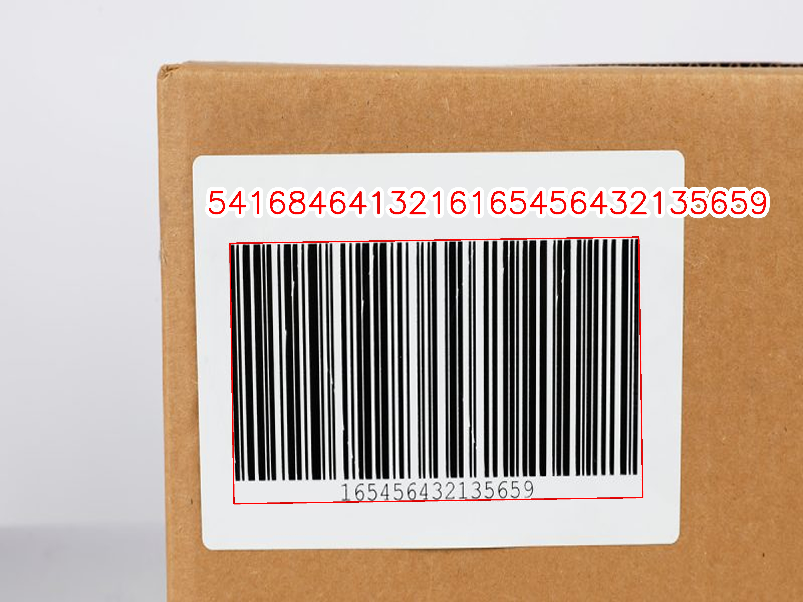
**test4.jpg**
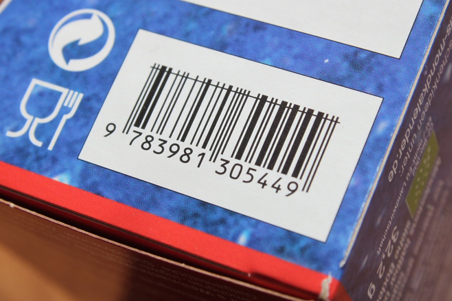
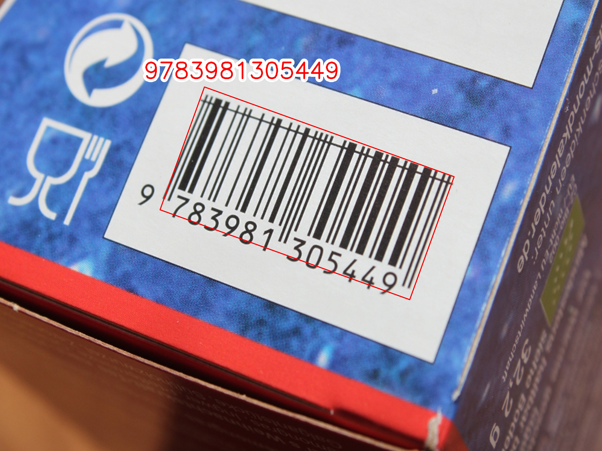
**test5.jpg**

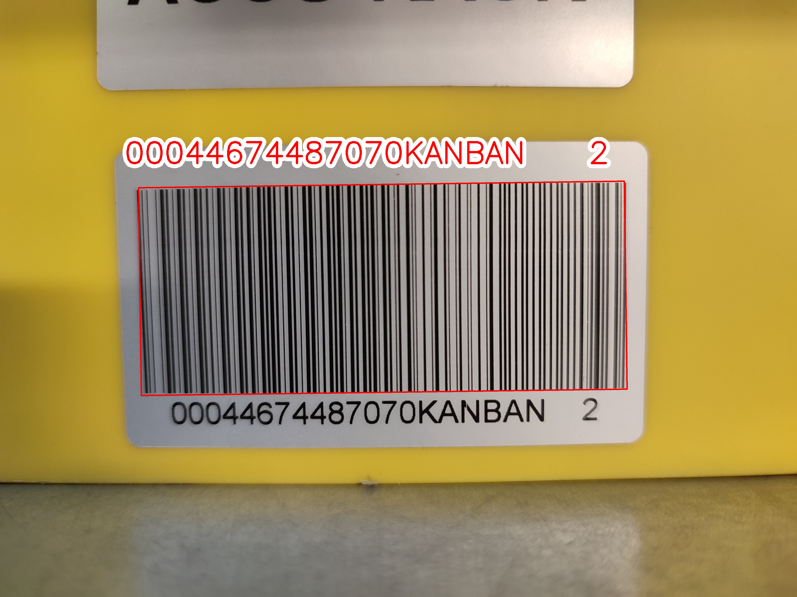
**test6.jpg**

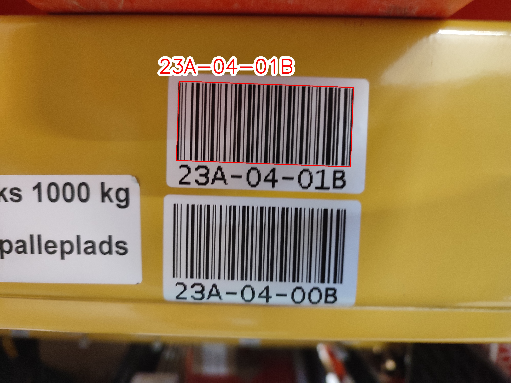
**test7.jpg**

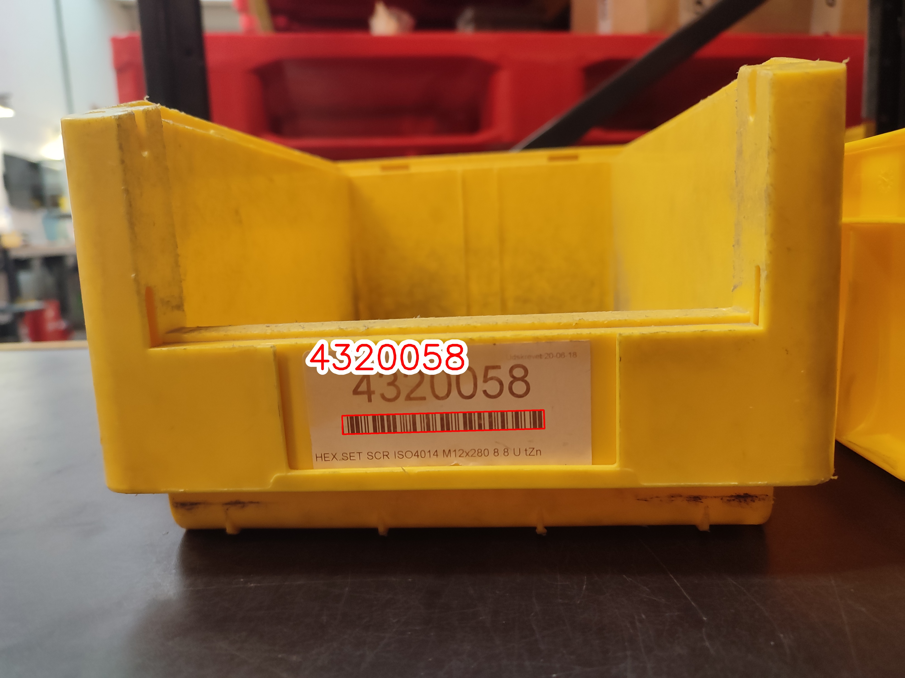
**test8.jpg**

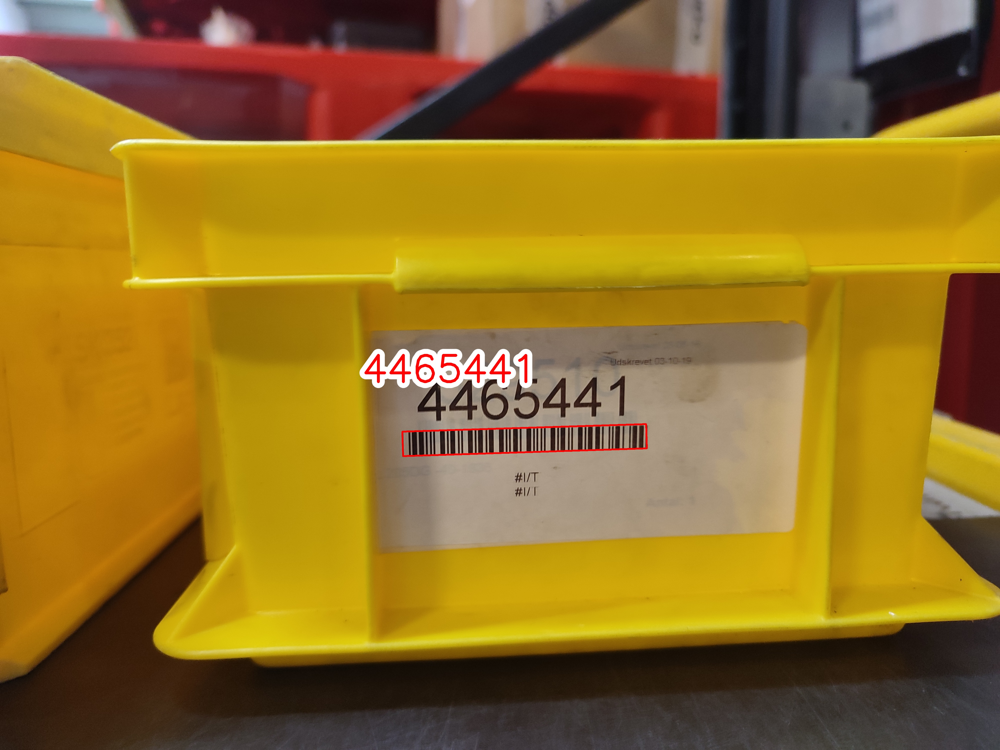
**test9.jpg**

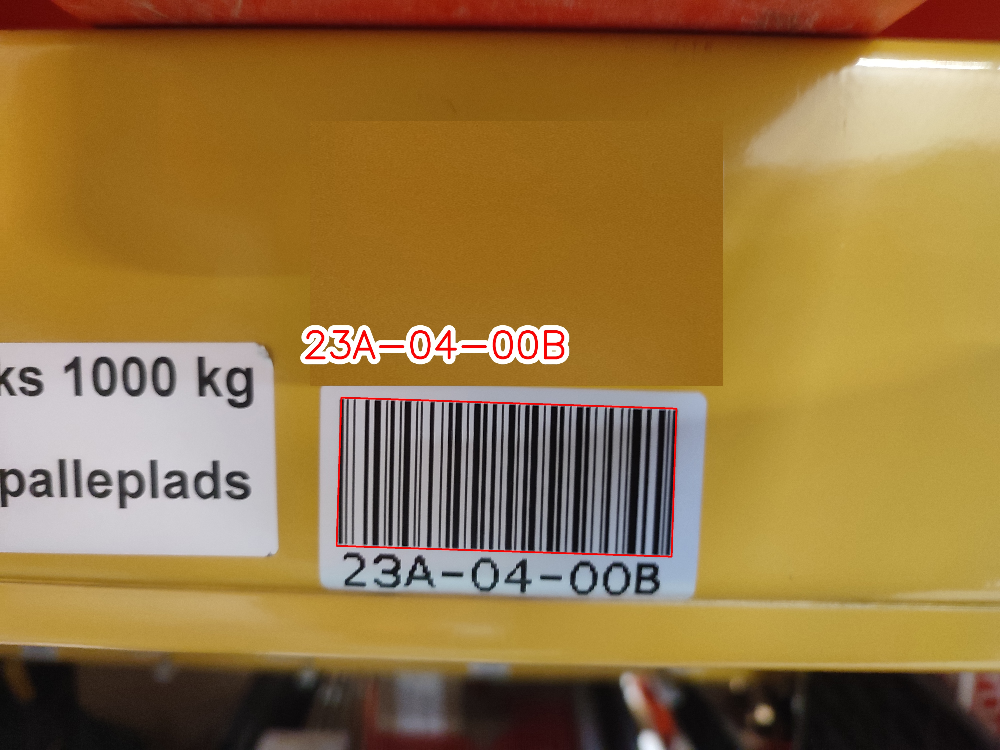

# Reference
This code is modified from [this git repository](https://github.com/pyxploiter/Barcode-Detection-and-Decoding).
